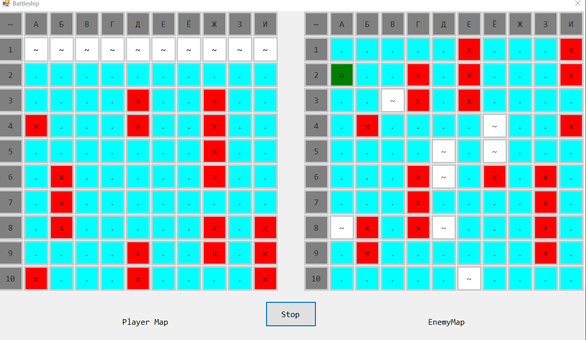

# Battleship in C++/CLR (Windows Forms Visual C++) #

One day someone asked me to write a program to play Battleship. Using the power of the modern Internet, I did it.

## Description ##

Task: Battleship

The 10 by 10 position field has invisible enemy ships: 4 ships of 1 square, three ships of 2 squares, 2 ships of 3 squares, 1 ship of 4 squares. Positions are indicated in Russian letters from A to K (by rows) and numbers from 1 to 10 (by columns). The configuration and position of the ships on the field are selected using a random number generator. If the player guesses the square of the ship correctly, it is marked with a cross; otherwise, a dot.

Write a program to play against the computer in a one-sided battleship.

## Demonstration ##

### General Demonstration of the Program ###

### Random Map Demonstration ###

### Victory Demonstration ###

### Defeat Demonstration ###

### Map Cleaning Demonstration ###

## License ##

[MIT](LICENSE.md)