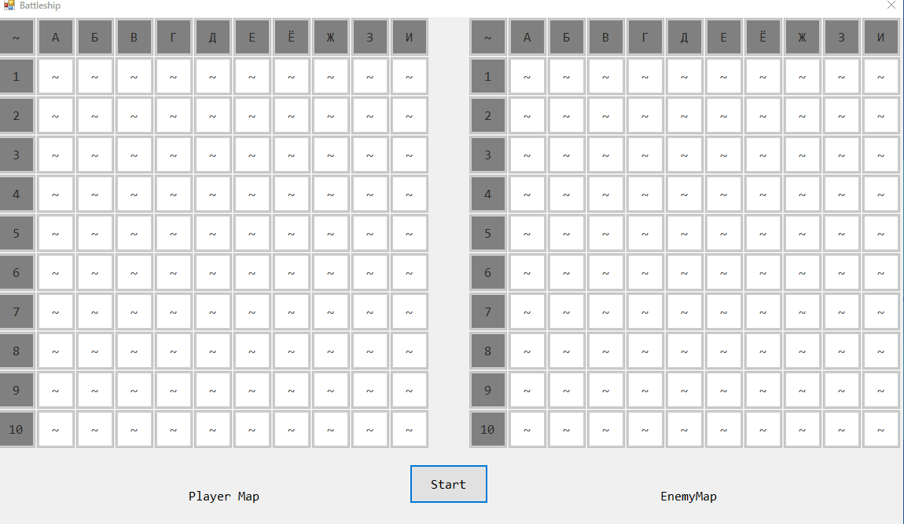
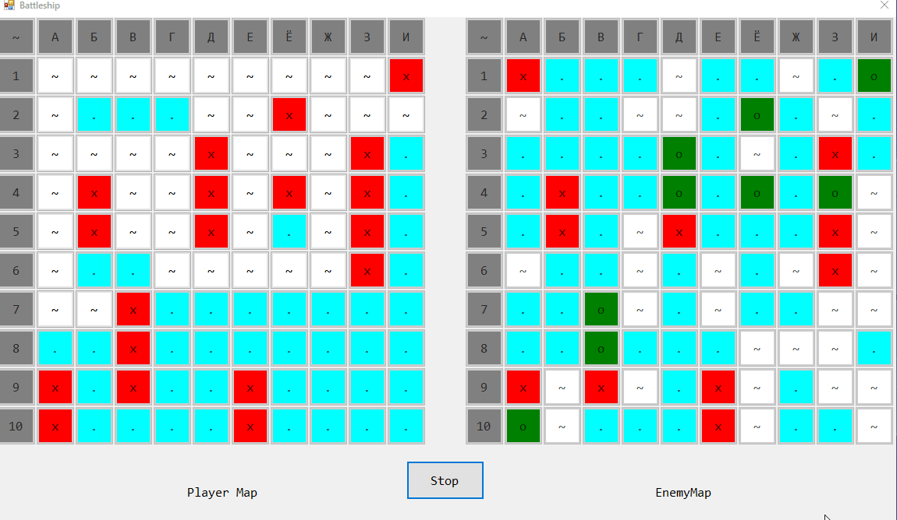
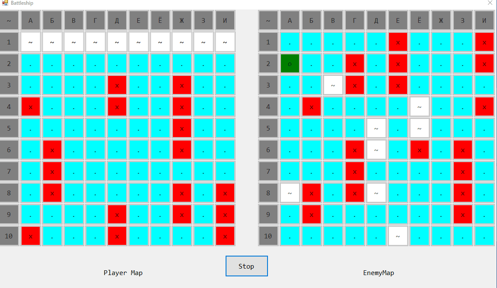

# Морской бой на C++/CLR (Windows Forms Visual C++) #

Однажды какой-то человек попросил меня написать программу для игры в Морской бой. Используя возможности современного Интернета, я это сделал.

## Описание ##

Задание: Морской бой

На поле 10 на 10 позиций стоят невидимые вражеские корабли: 4 корабля по одной клетке, три корабля по 2 клетки, 2 корабля по 3 клетки, 1 корабль в 4 клетки. Позиции указываются русскими буквами от А до К (по строкам) и цифрами от 1 до 10 (по столбцам). Конфигурация и положение кораблей на поле выбираются с помощью датчика случайных чисел. Если клетка корабля угадана играющим верно, она отмечается крестиком; в противном случае точкой.

Написать программу для игры против компьютера в односторонний морской бой.

## Демонстрация ##

### Общая демонстрация работы программы ###

### Демонстрация случайных карт ###

### Демонстрация победы ###

### Демонстрация поражения ###

### Демонстрация очистки карт ###

## Лицензия ##

[MIT](LICENSE.md)